Time Series Forecasting
================
Abhay Kulkarni
9/21/2019


# Introduction

## What is **Time Series?**

A time series is a series of data points **indexed in time order**. Most
commonly, a time series is a **sequence taken at successive equally
spaced points in time**.

## Why **forecast** Time Series?

<p>

If there’s one thing today’s planners and managers wish they had to
ensure their planning and production strategies, it would be a crystal
ball. A magical ability to glimpse into the future in order to cut the
complexity and uncertainty of modern manufacturing and provide a path of
stability and certainty in a variant-rich value stream.

</p>

<p>

Forecasting. Or, in other words, the ability to see into the future and
make educated predictions about any number of production elements such
as material sourcing, job allocation, transport logistics, and more. In
fact, forecasting is such an increasingly valuable proposition for
manufacturing companies that an August 2016 study by Gartner indicated
forecasting (and the accuracy thereof) and production variability were
two of the greatest obstacles manufacturing companies when overseeing
their supply streams.

</p>

<p>

Forecasting gives companies the ability to see into the future to avoid
this hypothetical accident via more effective production scheduling to
meet customer demands and market forces, and to align with the
availability of raw materials and component parts. Because forecasting
gives manufacturing companies a leg-up on these elements of planning and
production cycles, companies can operate with more agility,
transparency, and flexibility to adapt to changing production
environments or schemes.

</p>

# Project Objective

Explore the gas (Australian monthly gas production) dataset in Forecast
package to do the following :

</p>

## To do the following :

  - Read the data as a time series object in R. Plot the data
  - What do you observe? Which components of the time series are present
    in this dataset?
  - What is the periodicity of dataset?
  - Is the time series Stationary? Inspect visually as well as conduct
    an ADF test? Write down the null and alternate hypothesis for the
    stationarity test? De-seasonalise the series if seasonality is
    present?
  - Develop an ARIMA Model to forecast for next 12 periods. Use both
    manual and auto.arima (Show & explain all the steps)
  - Report the accuracy of the model

# Libraries/ Packages

``` r
library("forecast")
```

    ## Registered S3 method overwritten by 'quantmod':
    ##   method            from
    ##   as.zoo.data.frame zoo

``` r
library("ggplot2")
library("tseries")
library(MLmetrics)
```

    ## 
    ## Attaching package: 'MLmetrics'

    ## The following object is masked from 'package:base':
    ## 
    ##     Recall

``` r
library(cowplot)
```

    ## 
    ## ********************************************************

    ## Note: As of version 1.0.0, cowplot does not change the

    ##   default ggplot2 theme anymore. To recover the previous

    ##   behavior, execute:
    ##   theme_set(theme_cowplot())

    ## ********************************************************

``` r
library(DataExplorer)
```

# Speeding Processor Cores

``` r
library(parallel)
library(doParallel)
```

    ## Warning: package 'doParallel' was built under R version 4.0.2

    ## Loading required package: foreach

    ## Warning: package 'foreach' was built under R version 4.0.2

    ## Loading required package: iterators

    ## Warning: package 'iterators' was built under R version 4.0.2

``` r
clusterforspeed <- makeCluster(detectCores() - 1) ## convention to leave 1 core for OS
registerDoParallel(clusterforspeed)
```

# Step by Step Approach

## Set Working Directory

``` r
setwd("H:\\Github PROJECTS\\Time Series Forecasting\\Time_Series_Forecasting")
getwd()
```

    ## [1] "H:/Github PROJECTS/Time Series Forecasting/Time_Series_Forecasting"

## Read Australian Monthly Gas

``` r
head(gas)
```

    ##       Jan  Feb  Mar  Apr  May  Jun
    ## 1956 1709 1646 1794 1878 2173 2321

``` r
tail(gas)
```

    ##        Mar   Apr   May   Jun   Jul   Aug
    ## 1995 46287 49013 56624 61739 66600 60054

``` r
frequency(gas)
```

    ## [1] 12

**Findings**

Periodicity of dataset is **Monthly data from 1956 to 1995**

## Import Data as Time Series Data

``` r
rawdata<- ts(gas, start = c(1956,1), end = c(1995), frequency = 12)

head(rawdata)
```

    ##       Jan  Feb  Mar  Apr  May  Jun
    ## 1956 1709 1646 1794 1878 2173 2321

``` r
tail(rawdata)
```

    ##        Jan Feb Mar Apr May Jun Jul   Aug   Sep   Oct   Nov   Dec
    ## 1994                               63896 57784 53231 50354 38410
    ## 1995 41600

## Create backup of the raw time series and converting Rawdata to data frame

``` r
backupdata<- rawdata
rawdata<- ts(gas, start = c(1956,1), end = c(1995), frequency = 12)
class(rawdata)
```

    ## [1] "ts"

**NOTE**

Created backup of time series dataset.

## Components of TIME SERIES


## Steps to build ARIMA Time Series Model


## Checking for **Missing Values**

``` r
plot_missing(as.data.frame(rawdata))
```

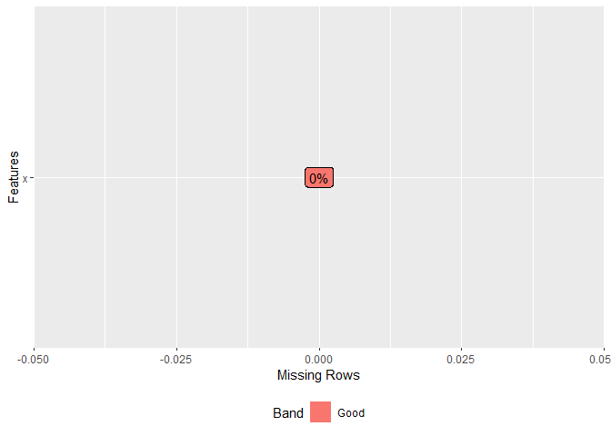<!-- -->

**Findings**

There is **No Missing** Values in the Dataset

## Data visualisations

``` r
reg_production <- lm(rawdata ~ time(rawdata))
plot(rawdata, main = "Monthly Production of Gas")
abline(reg_production, col = "blue")
```

<!-- -->

## Seasonal Plot

``` r
seasonplot <- ggseasonplot(rawdata)


seasonplot+ labs(title = "Seasonal plot of Australian Gas Production by Year")
```

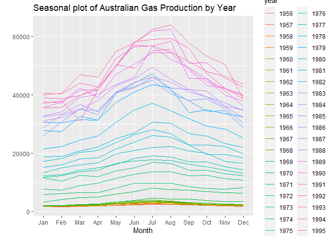<!-- -->

**Findings** :

The above plot clearly indicates there is **NO trend from 1956 to
1970**. However, **From 1970 to 1995 there is increase in trend**. Year
1990 March has the highest production.The production peaks during the
month of July and August. And a general high production is seen for the
month of April, May, June,July and August.

## Aggregate the cycles and display a year on year trend

``` r
plot(aggregate(rawdata,FUN=mean))
```

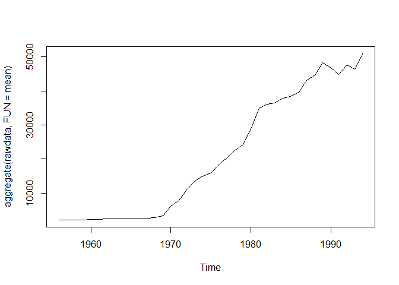<!-- -->
**Findings**

This supports our previous findings. The trend clearly starts increasing
from 1970

## Box plots across the months

``` r
 boxplot(rawdata ~ cycle(rawdata), names = month.abb, col = "light blue", 
        main = "Box Plots across the months")
```

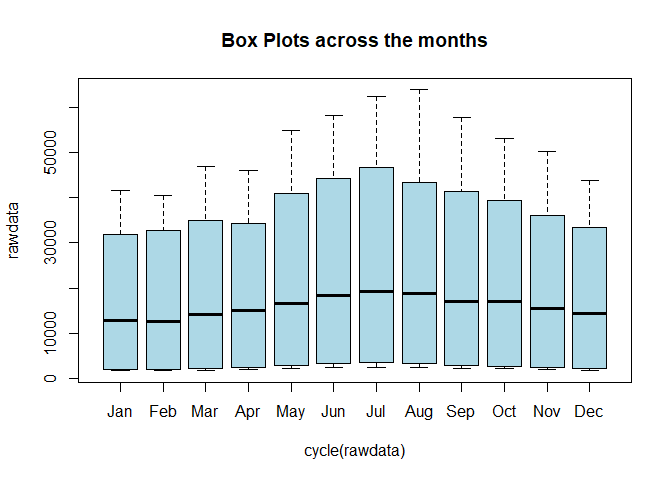<!-- -->

``` r
 ggsubseriesplot(rawdata)
```

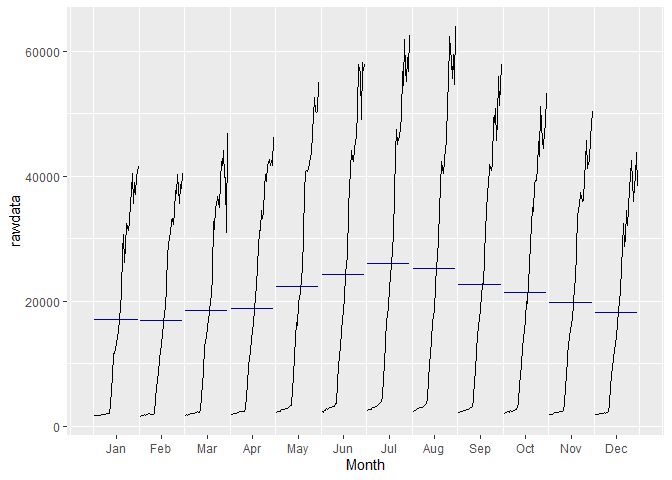<!-- -->

**Findings**

  - The horizontal lines indicate the means for each month. This form of
    plot enables the underlying seasonal pattern to be seen clearly, and
    also shows the changes in seasonality over time. It is especially
    useful in identifying changes within particular seasons. Also, we
    see variance in the dataset. Variance is also the HIGHEST in JULY
    month.

  - The mean value of June,July and August is higher than the other
    months indicating seasonality.

  - The variance and the mean value in June, July and August is much
    higher than rest of the months.

  - Exploring data becomes most important in a time series model –
    without this exploration, you will not know whether a series is
    stationary or not. As in this case we already know many details
    about the kind of model we are looking out for.

  - There is clear indication of Trend and Season component.

## Decompose data to look at the various components

``` r
decomp1 <- stl(rawdata, s.window = 'periodic')

plot(decomp1)
```

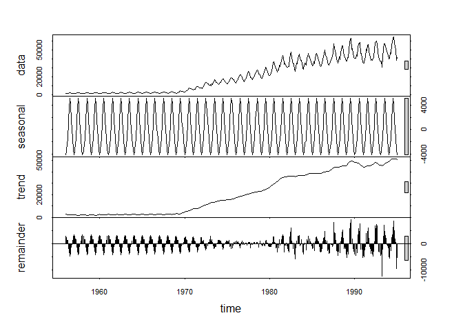<!-- -->

\#\# Lets try to Decompose data with window as 3

``` r
decomp3 <- stl(rawdata, s.window = 3)

plot(decomp3)
```

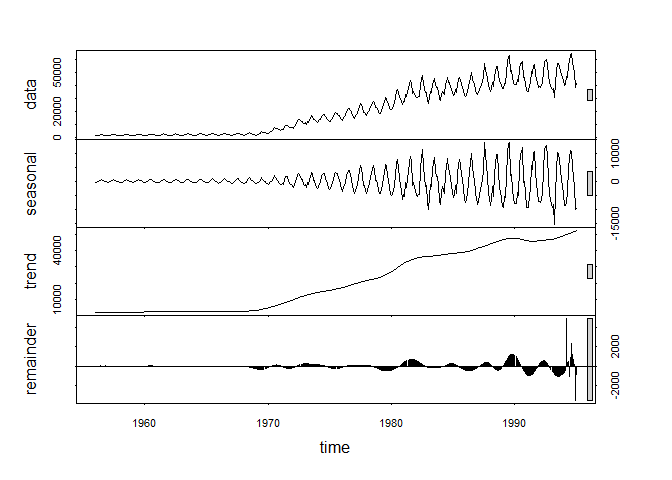<!-- -->

\#\# Lets try to Decompose data with window as 5

``` r
decomp5 <- stl(rawdata, s.window = 5)

plot(decomp5)
```

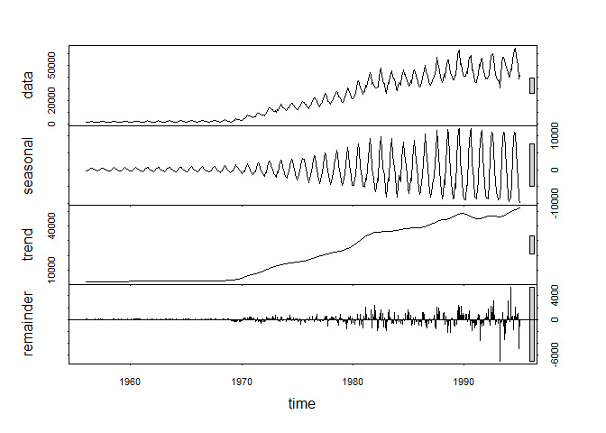<!-- -->

**Findings**

  - Decompose data with window as ‘Periodic’ looks smoother(Trend)

## Stationary VS Non Stationary

 There are three basic
criterion for a series to be classified as stationary series :

1.  The mean of the series should not be a function of time rather
    should be a constant. The image below has the left hand graph
    satisfying the condition whereas the graph in red has a time
    dependent mean.

2.  The variance of the series should not a be a function of time. This
    property is known as homoscedasticity. Following graph depicts what
    is and what is not a stationary series. (Notice the varying spread
    of distribution in the right hand graph)

3.  The covariance of the i th term and the (i + m) th term should not
    be a function of time. In the following graph, you will notice the
    spread becomes closer as the time increases. Hence, the covariance
    is not constant with time for the ‘red series’.

## De-seasonalize the data

``` r
deseasoned_production <- seasadj(decomp1)
plot(deseasoned_production)
abline(lm(deseasoned_production ~ time(deseasoned_production)), col = "blue")
```

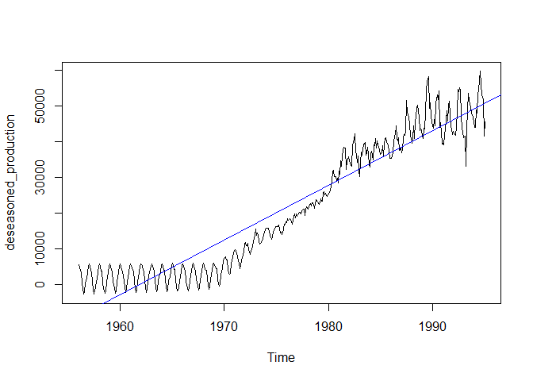<!-- -->

``` r
deseasoned_production
```

    ##             Jan        Feb        Mar        Apr        May        Jun
    ## 1956  5741.9571  5184.7295  3881.4047  3674.6568   555.6785 -1120.8057
    ## 1957  5783.9571  5226.7295  4007.4047  3737.6568   693.6785 -1162.8057
    ## 1958  5805.9571  5226.7295  3870.4047  3780.6568   672.6785  -930.8057
    ## 1959  5762.9571  5226.7295  3986.4047  3790.6568   724.6785  -888.8057
    ## 1960  5794.9571  5353.7295  4092.4047  3885.6568   999.6785  -613.8057
    ## 1961  5836.9571  5311.7295  4102.4047  3885.6568  1009.6785  -729.8057
    ## 1962  5900.9571  5353.7295  4134.4047  3938.6568  1125.6785  -666.8057
    ## 1963  5942.9571  5406.7295  4208.4047  4064.6568  1072.6785  -508.8057
    ## 1964  5921.9571  5522.7295  4197.4047  4107.6568  1167.6785  -402.8057
    ## 1965  5994.9571  5448.7295  4303.4047  4233.6568  1199.6785  -318.8057
    ## 1966  5942.9571  5479.7295  4303.4047  4138.6568  1305.6785  -212.8057
    ## 1967  6026.9571  5490.7295  4377.4047  4191.6568  1347.6785  -202.8057
    ## 1968  6026.9571  5479.7295  4345.4047  4128.6568  1705.6785   166.1943
    ## 1969  6089.9571  5638.7295  4545.4047  4434.6568  1674.6785   282.1943
    ## 1970  7377.9571  7758.7295  6961.4047  6860.6568  4333.6785  3332.1943
    ## 1971  9951.9571  9721.7295  8681.4047  8285.6568  6422.6785  6273.1943
    ## 1972 11810.9571 10940.7295 10990.4047 11538.6568  9754.6785  9299.1943
    ## 1973 15601.9571 13935.7295 14580.4047 13758.6568 12356.6785 11503.1943
    ## 1974 15736.9571 15813.7295 15782.4047 15878.6568 14937.6785 13897.1943
    ## 1975 16386.9571 16220.7295 16228.4047 16785.6568 14541.6785 14834.1943
    ## 1976 17292.9571 18528.7295 18062.4047 18566.6568 18201.6785 17541.1943
    ## 1977 19149.9571 19596.7295 20224.4047 20267.6568 19780.6785 20412.1943
    ## 1978 21275.9571 21822.7295 22313.4047 22699.6568 22150.6785 22881.1943
    ## 1979 22871.9571 22430.7295 22910.4047 24008.6568 23458.6785 23442.1943
    ## 1980 25465.9571 25907.7295 26590.4047 27701.6568 28987.6785 31542.1943
    ## 1981 31762.9571 30962.7295 34771.4047 33162.6568 35841.6785 37618.1943
    ## 1982 34747.9571 33938.7295 33538.4047 33102.6568 38974.6785 40691.1943
    ## 1983 30170.9571 34283.7295 37105.4047 36345.6568 39362.6785 39427.1943
    ## 1984 32833.9571 36572.7295 37381.4047 34977.6568 39179.6785 38913.1943
    ## 1985 36526.9571 36846.7295 38892.4047 36017.6568 39402.6785 40908.1943
    ## 1986 35271.9571 35799.7295 37038.4047 39905.6568 41550.6785 42105.1943
    ## 1987 36823.9571 37744.7295 41215.4047 42045.6568 41901.6785 42695.1943
    ## 1988 39599.9571 41234.7295 44406.4047 40933.6568 45444.6785 47168.1943
    ## 1989 41573.9571 40815.7295 43865.4047 43462.6568 47998.6785 54351.1943
    ## 1990 44491.9571 43833.7295 46234.4047 44493.6568 50943.6785 53130.1943
    ## 1991 39624.9571 39215.7295 41951.4047 43557.6568 48762.6785 45687.1943
    ## 1992 42995.9571 42228.7295 41879.4047 44341.6568 48527.6785 54722.1943
    ## 1993 41091.9571 41501.7295 33130.4047 43508.6568 48748.6785 53535.1943
    ## 1994 44007.9571 44016.7295 48982.4047 47943.6568 53393.6785 54357.1943
    ## 1995 45632.9571                                                       
    ##             Jul        Aug        Sep        Oct        Nov        Dec
    ## 1956 -2643.3928 -1815.3794   634.6839  1923.0823  3386.8402  5093.5446
    ## 1957 -2473.3928 -1783.3794   729.6839  1965.0823  3365.8402  5146.5446
    ## 1958 -2399.3928 -1709.3794   792.6839  1997.0823  3355.8402  5178.5446
    ## 1959 -2399.3928 -1604.3794   813.6839  2113.0823  3450.8402  5178.5446
    ## 1960 -2146.3928 -1340.3794   982.6839  2165.0823  3640.8402  5294.5446
    ## 1961 -2104.3928 -1351.3794   940.6839  2039.0823  3629.8402  5252.5446
    ## 1962 -2083.3928 -1266.3794   951.6839  2303.0823  3555.8402  5283.5446
    ## 1963 -1893.3928 -1203.3794  1109.6839  2208.0823  3682.8402  5325.5446
    ## 1964 -1882.3928 -1161.3794  1109.6839  2345.0823  3661.8402  5410.5446
    ## 1965 -1766.3928 -1119.3794  1109.6839  2271.0823  3756.8402  5378.5446
    ## 1966 -1598.3928  -876.3794  1299.6839  2482.0823  3819.8402  5473.5446
    ## 1967 -1503.3928  -707.3794  1468.6839  2450.0823  3787.8402  5515.5446
    ## 1968 -1154.3928  -559.3794  1605.6839  2735.0823  4009.8402  5652.5446
    ## 1969  -459.3928   147.6206  2681.6839  3558.0823  4853.8402  6729.5446
    ## 1970  2885.6072  3291.6206  5888.6839  6681.0823  7913.8402  9556.5446
    ## 1971  4602.6072  5524.6206  7045.6839  7663.0823  9177.8402 11422.5446
    ## 1972  8621.6072  9459.6206 10689.6839 12304.0823 12665.8402 14097.5446
    ## 1973 11693.6072 12355.6206 12675.6839 13959.0823 14440.8402 15521.5446
    ## 1974 12665.6072 13360.6206 14644.6839 15138.0823 15632.8402 16384.5446
    ## 1975 14045.6072 14505.6206 15559.6839 16896.0823 16842.8402 17580.5446
    ## 1976 16889.6072 18105.6206 19200.6839 19771.0823 18717.8402 19766.5446
    ## 1977 20913.6072 21247.6206 21254.6839 19421.0823 21051.8402 21756.5446
    ## 1978 22926.6072 22544.6206 21336.6839 22615.0823 23828.8402 23063.5446
    ## 1979 25499.6072 25996.6206 25212.6839 25687.0823 24752.8402 25198.5446
    ## 1980 31948.6072 30270.6206 30243.6839 29077.0823 29729.8402 28516.5446
    ## 1981 38446.6072 38166.6206 32277.6839 34764.0823 34904.8402 35713.5446
    ## 1982 42275.6072 37078.6206 36363.6839 34157.0823 36031.8402 31997.5446
    ## 1983 39910.6072 36155.6206 36630.6839 38410.0823 36732.8402 33502.5446
    ## 1984 40986.6072 38198.6206 40301.6839 39133.0823 38752.8402 37782.5446
    ## 1985 41061.6072 40203.6206 39393.6839 39071.0823 37325.8402 35410.5446
    ## 1986 44456.6072 41155.6206 40255.6839 41083.0823 37492.8402 38147.5446
    ## 1987 51597.6072 48074.6206 47847.6839 45302.0823 41281.8402 41226.5446
    ## 1988 49345.6072 50203.6206 46966.6839 43027.0823 43579.8402 43263.5446
    ## 1989 56772.6072 58168.6206 49270.6839 50918.0823 47155.8402 45796.5446
    ## 1990 51746.6072 54131.6206 44077.6839 45424.0823 42728.8402 39284.5446
    ## 1991 49954.6072 51439.6206 47508.6839 44305.0823 43569.8402 41966.5446
    ## 1992 53923.6072 55176.6206 54438.6839 47123.0823 43693.8402 42874.5446
    ## 1993 51695.6072 50402.6206 49817.6839 47875.0823 47675.8402 47004.5446
    ## 1994 57338.6072 59664.6206 56234.6839 53033.0823 51778.8402 41678.5446
    ## 1995

## Check for stationarityof the original dataset

``` r
# Dickey-Fuller test
adf.test(rawdata, alternative = "stationary")
```

    ## 
    ##  Augmented Dickey-Fuller Test
    ## 
    ## data:  rawdata
    ## Dickey-Fuller = -2.6962, Lag order = 7, p-value = 0.2835
    ## alternative hypothesis: stationary

**Findings**

  - Null Hypothesis (H0): If accepted, it suggests the time series has a
    unit root, meaning it is non-stationary. It has some time dependent
    structure. Alternate Hypothesis (H1): The null hypothesis is
    rejected; it suggests the time series does not have a unit root,
    meaning it is stationary. It does not have time-dependent structure.

  - We fail to reject the Null hypothesis. This is a NON STATIONARY DATA

## ACF and PACF plots - on the non-stationary data(Original)

 

``` r
acf(rawdata)
```

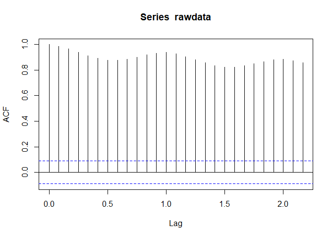<!-- -->

``` r
pacf(rawdata)
```

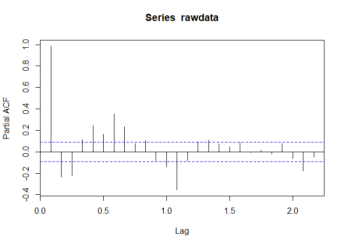<!-- -->

**Findings**

  - Clearly, the decay of ACF chart is very slow, which means that the
    population is not stationary. Let’s see how ACF and PACF curve come
    out after regressing on the difference.

## Check for stationarity of the deseasoned series dataset

``` r
# Dickey-Fuller test
adf.test(deseasoned_production, alternative = "stationary")
```

    ## 
    ##  Augmented Dickey-Fuller Test
    ## 
    ## data:  deseasoned_production
    ## Dickey-Fuller = -2.4149, Lag order = 7, p-value = 0.4025
    ## alternative hypothesis: stationary

**Findings**

  - Fail to reject de-seasonal data. Have to De-Trend(Difference)
    further.

## Differencing the time series data - to remove the trend

``` r
detrended_production = diff(deseasoned_production, differences = 1)
plot(detrended_production)
```

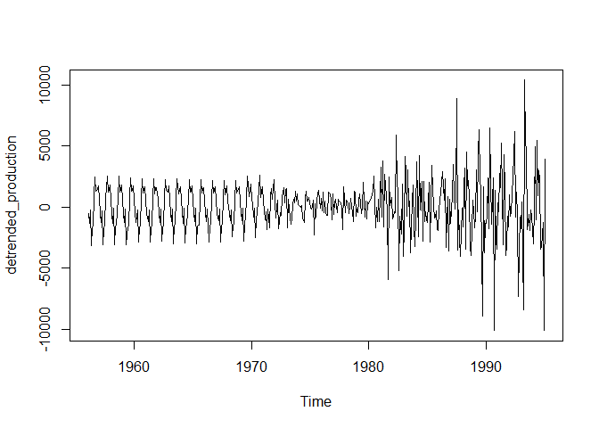<!-- -->

## Check for Stationarity

``` r
# Dickey-Fuller test
adf.test(detrended_production, alternative = "stationary")
```

    ## Warning in adf.test(detrended_production, alternative = "stationary"): p-value
    ## smaller than printed p-value

    ## 
    ##  Augmented Dickey-Fuller Test
    ## 
    ## data:  detrended_production
    ## Dickey-Fuller = -17.952, Lag order = 7, p-value = 0.01
    ## alternative hypothesis: stationary

**Findings**

  - We reject Null Hypothesis and go with Alternative Hypothesis. Time
    Serie data is NOW STATIONARY

## ACF and PACF plots - on differenced TS

``` r
acf(detrended_production, main = "ACF for differenced series")
```

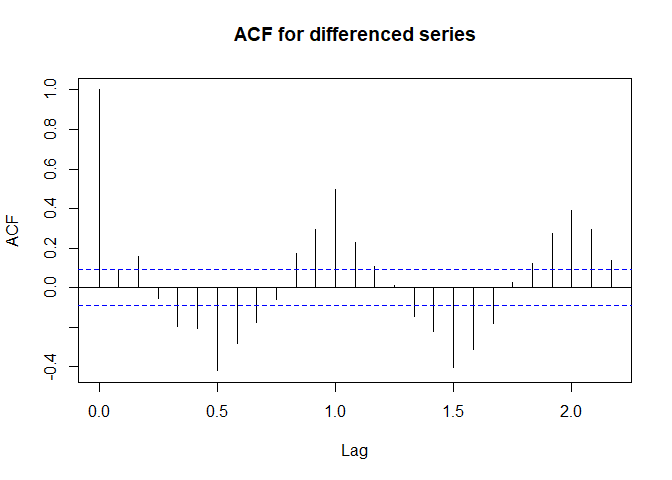<!-- -->

``` r
pacf(detrended_production, main = "PACF for differenced series")
```

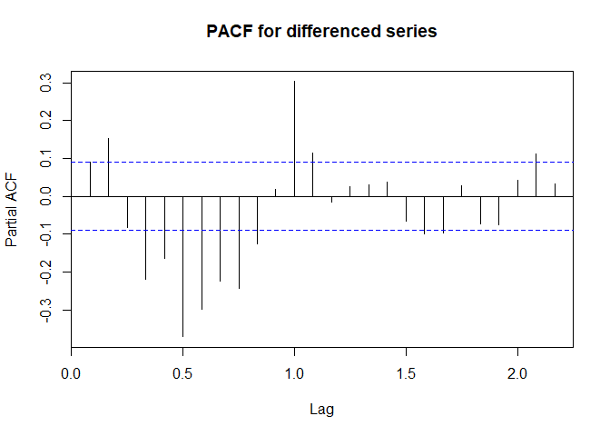<!-- -->

**Findings**

  - Clearly, ACF plot cuts off after the 2 lag. So, q will be 2 and PACF
    cuts off at 2 aswell. q also will be 2 and d will be 1 as we
    differenced our time series data once.

# Split the Dateset into Training Set and Test Set

``` r
production_train <- window(deseasoned_production, start=1956, end = c(1988))
production_test <- window(deseasoned_production, start = 1989)
str(production_train)
```

    ##  Time-Series [1:385] from 1956 to 1988: 5742 5185 3881 3675 556 ...

``` r
str(production_test)
```

    ##  Time-Series [1:73] from 1989 to 1995: 41574 40816 43865 43463 47999 ...

## Build the ARIMA model


``` r
productionARIMA1 <- arima(production_train, order = c(2, 1, 2)) 
productionARIMA1
```

    ## 
    ## Call:
    ## arima(x = production_train, order = c(2, 1, 2))
    ## 
    ## Coefficients:
    ##           ar1     ar2     ma1     ma2
    ##       -0.2642  0.0387  0.4409  0.1903
    ## s.e.   0.2785  0.1852  0.2761  0.1922
    ## 
    ## sigma^2 estimated as 2504927:  log likelihood = -3373.81,  aic = 6757.62

``` r
tsdisplay(residuals(productionARIMA1), lag.max = 15, main = "Model Residuals")
```

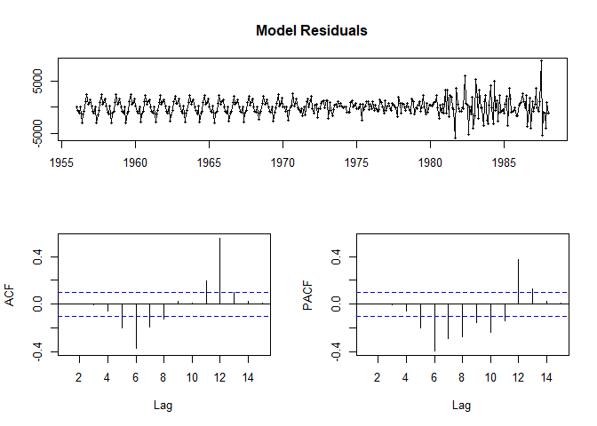<!-- -->

## Fitting with Auto ARIMA

``` r
fitautoarima <- auto.arima(production_train, seasonal = FALSE)
fitautoarima
```

    ## Series: production_train 
    ## ARIMA(1,1,3) with drift 
    ## 
    ## Coefficients:
    ##          ar1      ma1      ma2      ma3     drift
    ##       0.6130  -0.5597  -0.0331  -0.2727  104.6819
    ## s.e.  0.0709   0.0790   0.0561   0.0515   27.3930
    ## 
    ## sigma^2 estimated as 2295865:  log likelihood=-3354.8
    ## AIC=6721.61   AICc=6721.83   BIC=6745.31

``` r
tsdisplay(residuals(fitautoarima), lag.max = 45, main = "Auto ARIMA Model Residuals")
```

<!-- -->

## Ljung - Box Test - Residual Analysis

Ho: Residuals are independent Ha: Residuals are not independent

``` r
Box.test(productionARIMA1$residuals)
```

    ## 
    ##  Box-Pierce test
    ## 
    ## data:  productionARIMA1$residuals
    ## X-squared = 0.0010986, df = 1, p-value = 0.9736

**Findings**

  - Residuals are independednt. They follow normal distribution.
    Clearly, we can use productionARIMA1(VALID)

<!-- end list -->

``` r
Box.test(fitautoarima$residuals)
```

    ## 
    ##  Box-Pierce test
    ## 
    ## data:  fitautoarima$residuals
    ## X-squared = 0.073347, df = 1, p-value = 0.7865

**Findings**

  - Residuals are independednt. They follow normal distribution.
    Clearly, we can use fitautoarima(VALID)

## Forecasting with the ARIMA model

``` r
fcastproduction1 = forecast(productionARIMA1, h=72)
fcastproduction1
```

    ##          Point Forecast    Lo 80    Hi 80     Lo 95    Hi 95
    ## Feb 1988       39707.44 37679.14 41735.75 36605.414 42809.47
    ## Mar 1988       39398.33 36266.09 42530.58 34607.974 44188.69
    ## Apr 1988       39484.14 35311.73 43656.56 33102.985 45865.31
    ## May 1988       39449.52 34494.50 44404.55 31871.463 47027.58
    ## Jun 1988       39461.99 33814.73 45109.25 30825.246 48098.73
    ## Jul 1988       39457.35 33199.46 45715.25 29886.724 49027.99
    ## Aug 1988       39459.06 32643.12 46275.00 29034.985 49883.14
    ## Sep 1988       39458.43 32127.46 46789.40 28246.678 50670.18
    ## Oct 1988       39458.66 31646.31 47271.01 27510.706 51406.62
    ## Nov 1988       39458.58 31192.92 47724.24 26817.338 52099.82
    ## Dec 1988       39458.61 30763.21 48154.01 26160.139 52757.08
    ## Jan 1989       39458.60 30353.73 48563.47 25533.898 53383.30
    ## Feb 1989       39458.60 29961.90 48955.31 24934.643 53982.56
    ## Mar 1989       39458.60 29585.60 49331.60 24359.149 54558.05
    ## Apr 1989       39458.60 29223.13 49694.07 23804.799 55112.40
    ## May 1989       39458.60 28873.06 50044.14 23269.420 55647.78
    ## Jun 1989       39458.60 28534.21 50382.99 22751.188 56166.01
    ## Jul 1989       39458.60 28205.56 50711.64 22248.554 56668.65
    ## Aug 1989       39458.60 27886.23 51030.97 21760.189 57157.01
    ## Sep 1989       39458.60 27575.48 51341.72 21284.943 57632.26
    ## Oct 1989       39458.60 27272.66 51644.54 20821.811 58095.39
    ## Nov 1989       39458.60 26977.18 51940.02 20369.913 58547.29
    ## Dec 1989       39458.60 26688.53 52228.67 19928.469 58988.73
    ## Jan 1990       39458.60 26406.27 52510.93 19496.784 59420.42
    ## Feb 1990       39458.60 26129.98 52787.22 19074.239 59842.96
    ## Mar 1990       39458.60 25859.31 53057.89 18660.277 60256.92
    ## Apr 1990       39458.60 25593.92 53323.28 18254.395 60662.81
    ## May 1990       39458.60 25333.51 53583.69 17856.138 61061.06
    ## Jun 1990       39458.60 25077.82 53839.38 17465.091 61452.11
    ## Jul 1990       39458.60 24826.59 54090.61 17080.877 61836.32
    ## Aug 1990       39458.60 24579.61 54337.59 16703.149 62214.05
    ## Sep 1990       39458.60 24336.66 54580.54 16331.589 62585.61
    ## Oct 1990       39458.60 24097.55 54819.65 15965.905 62951.30
    ## Nov 1990       39458.60 23862.11 55055.09 15605.827 63311.37
    ## Dec 1990       39458.60 23630.17 55287.03 15251.104 63666.10
    ## Jan 1991       39458.60 23401.58 55515.62 14901.505 64015.70
    ## Feb 1991       39458.60 23176.20 55741.00 14556.813 64360.39
    ## Mar 1991       39458.60 22953.89 55963.31 14216.828 64700.37
    ## Apr 1991       39458.60 22734.54 56182.66 13881.362 65035.84
    ## May 1991       39458.60 22518.03 56399.17 13550.239 65366.96
    ## Jun 1991       39458.60 22304.26 56612.94 13223.295 65693.91
    ## Jul 1991       39458.60 22093.11 56824.09 12900.375 66016.83
    ## Aug 1991       39458.60 21884.50 57032.70 12581.335 66335.87
    ## Sep 1991       39458.60 21678.34 57238.86 12266.038 66651.16
    ## Oct 1991       39458.60 21474.54 57442.66 11954.354 66962.85
    ## Nov 1991       39458.60 21273.03 57644.18 11646.164 67271.04
    ## Dec 1991       39458.60 21073.72 57843.48 11341.352 67575.85
    ## Jan 1992       39458.60 20876.55 58040.65 11039.808 67877.39
    ## Feb 1992       39458.60 20681.45 58235.75 10741.431 68175.77
    ## Mar 1992       39458.60 20488.36 58428.84 10446.122 68471.08
    ## Apr 1992       39458.60 20297.21 58619.99 10153.789 68763.41
    ## May 1992       39458.60 20107.96 58809.24  9864.344 69052.86
    ## Jun 1992       39458.60 19920.53 58996.67  9577.702 69339.50
    ## Jul 1992       39458.60 19734.89 59182.31  9293.784 69623.42
    ## Aug 1992       39458.60 19550.97 59366.23  9012.513 69904.69
    ## Sep 1992       39458.60 19368.74 59548.46  8733.817 70183.38
    ## Oct 1992       39458.60 19188.15 59729.05  8457.627 70459.57
    ## Nov 1992       39458.60 19009.16 59908.04  8183.875 70733.33
    ## Dec 1992       39458.60 18831.71 60085.49  7912.499 71004.70
    ## Jan 1993       39458.60 18655.78 60261.42  7643.438 71273.76
    ## Feb 1993       39458.60 18481.33 60435.87  7376.633 71540.57
    ## Mar 1993       39458.60 18308.31 60608.89  7112.029 71805.17
    ## Apr 1993       39458.60 18136.70 60780.50  6849.571 72067.63
    ## May 1993       39458.60 17966.46 60950.74  6589.210 72327.99
    ## Jun 1993       39458.60 17797.56 61119.64  6330.894 72586.31
    ## Jul 1993       39458.60 17629.96 61287.24  6074.578 72842.62
    ## Aug 1993       39458.60 17463.64 61453.56  5820.214 73096.99
    ## Sep 1993       39458.60 17298.57 61618.63  5567.759 73349.44
    ## Oct 1993       39458.60 17134.72 61782.48  5317.171 73600.03
    ## Nov 1993       39458.60 16972.06 61945.14  5068.409 73848.79
    ## Dec 1993       39458.60 16810.57 62106.63  4821.434 74095.77
    ## Jan 1994       39458.60 16650.23 62266.97  4576.207 74340.99

``` r
hist(fcastproduction1$residuals)
```

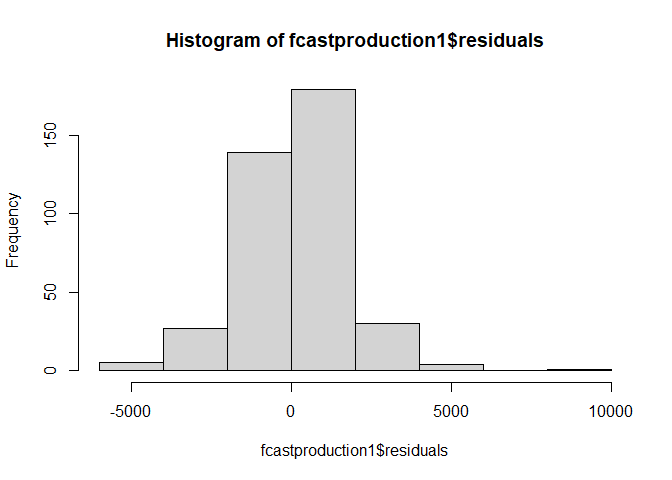<!-- -->

``` r
plot(fcastproduction1$x,col="blue", main= "Production: Actual vs Forecast") 
lines(fcastproduction1$fitted,col="red")
```

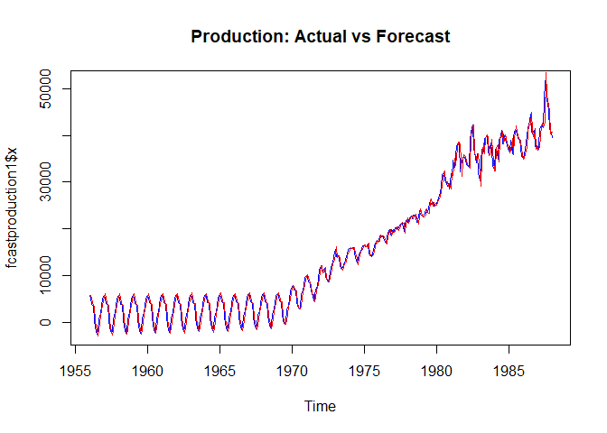<!-- -->

## Forecasting with the AUTO ARIMA model

``` r
fcast_autoArima = forecast(fitautoarima, h=72)
plot(fcast_autoArima)
```

<!-- -->

``` r
plot(fcast_autoArima$x,col="blue", main= "production A: Actual vs Forecast") 
lines(fcast_autoArima$fitted,col="red")
```

<!-- -->

## compute accuracy of the forecast - on the test data

``` r
accuracy(fcastproduction1, production_test)
```

    ##                      ME     RMSE      MAE       MPE     MAPE      MASE
    ## Training set   65.86242 1580.639 1144.675  4.189034 41.99990 0.7705425
    ## Test set     7264.95626 8843.112 7486.108 14.550004 15.21109 5.0393032
    ##                     ACF1 Theil's U
    ## Training set -0.00168923        NA
    ## Test set      0.71747562  2.142791

## compute accuracy of the forecast AUTO ARIMA - on the test data

``` r
AccuracyautoARIMA <- accuracy(fcast_autoArima, production_test)
AccuracyautoARIMA
```

    ##                      ME     RMSE      MAE       MPE      MAPE     MASE
    ## Training set -15.398827 1503.358 1062.372  5.082934 40.564921 0.715140
    ## Test set       2.707461 5433.903 4291.068 -1.194270  9.269967 2.888549
    ##                    ACF1 Theil's U
    ## Training set 0.01380263        NA
    ## Test set     0.75551069  1.410208

## Let’s try other values and try to reduce error

``` r
productionARIMA2 <- arima(production_train, order = c(2, 2, 1)) 
productionARIMA2
```

    ## 
    ## Call:
    ## arima(x = production_train, order = c(2, 2, 1))
    ## 
    ## Coefficients:
    ##          ar1     ar2      ma1
    ##       0.1658  0.1318  -1.0000
    ## s.e.  0.0507  0.0507   0.0077
    ## 
    ## sigma^2 estimated as 2534944:  log likelihood = -3369.91,  aic = 6747.82

``` r
tsdisplay(residuals(productionARIMA2), lag.max = 15, main = "Model Residuals")
```

<!-- -->

``` r
Box.test(productionARIMA2$residuals)
```

    ## 
    ##  Box-Pierce test
    ## 
    ## data:  productionARIMA2$residuals
    ## X-squared = 0.065203, df = 1, p-value = 0.7985

**Findings**

  - Residuals are independent. They follow normal distribution. Clearly,
    we can use productionARIMA2(VALID)

## Forecasting with the ARIMA2 model

``` r
fcastproduction2 = forecast(productionARIMA2, h=72)
fcastproduction2
```

    ##          Point Forecast    Lo 80    Hi 80     Lo 95    Hi 95
    ## Feb 1988       39382.62 37339.55 41425.69 36258.012 42507.22
    ## Mar 1988       39191.73 36049.75 42333.71 34386.490 43996.97
    ## Apr 1988       39191.02 35036.12 43345.91 32836.651 45545.38
    ## May 1988       39225.32 34201.42 44249.21 31541.933 46908.70
    ## Jun 1988       39290.49 33494.31 45086.67 30425.997 48154.98
    ## Jul 1988       39365.40 32874.85 45855.95 29438.960 49291.84
    ## Aug 1988       39445.99 32320.68 46571.30 28548.775 50343.21
    ## Sep 1988       39528.81 31816.13 47241.49 27733.288 51324.33
    ## Oct 1988       39612.75 31350.88 47874.61 26977.320 52248.17
    ## Nov 1988       39697.16 30917.57 48476.75 26269.933 53124.39
    ## Dec 1988       39781.80 30510.84 49052.77 25603.086 53960.52
    ## Jan 1989       39866.55 30126.66 49606.44 24970.672 54762.42
    ## Feb 1989       39951.34 29761.91 50140.77 24367.948 55534.73
    ## Mar 1989       40036.15 29414.11 50658.18 23791.147 56281.15
    ## Apr 1989       40120.97 29081.28 51160.65 23237.224 57004.71
    ## May 1989       40205.79 28761.77 51649.81 22703.673 57707.91
    ## Jun 1989       40290.62 28454.22 52127.02 22188.406 58392.83
    ## Jul 1989       40375.45 28157.47 52593.42 21689.662 59061.23
    ## Aug 1989       40460.27 27870.54 53050.01 21205.939 59714.61
    ## Sep 1989       40545.10 27592.59 53497.61 20735.942 60354.26
    ## Oct 1989       40629.93 27322.88 53936.98 20278.550 60981.31
    ## Nov 1989       40714.76 27060.77 54368.75 19832.780 61596.74
    ## Dec 1989       40799.59 26805.69 54793.48 19397.769 62201.40
    ## Jan 1990       40884.41 26557.15 55211.68 18972.749 62796.08
    ## Feb 1990       40969.24 26314.69 55623.79 18557.040 63381.45
    ## Mar 1990       41054.07 26077.92 56030.22 18150.030 63958.11
    ## Apr 1990       41138.90 25846.49 56431.31 17751.172 64526.63
    ## May 1990       41223.73 25620.05 56827.40 17359.969 65087.49
    ## Jun 1990       41308.56 25398.33 57218.78 16975.972 65641.14
    ## Jul 1990       41393.38 25181.06 57605.71 16598.772 66187.99
    ## Aug 1990       41478.21 24967.98 57988.44 16227.996 66728.43
    ## Sep 1990       41563.04 24758.89 58367.19 15863.303 67262.78
    ## Oct 1990       41647.87 24553.56 58742.18 15504.379 67791.36
    ## Nov 1990       41732.70 24351.82 59113.58 15150.935 68314.46
    ## Dec 1990       41817.52 24153.48 59481.57 14802.703 68832.35
    ## Jan 1991       41902.35 23958.40 59846.31 14459.438 69345.27
    ## Feb 1991       41987.18 23766.41 60207.96 14120.911 69853.45
    ## Mar 1991       42072.01 23577.38 60566.64 13786.908 70357.11
    ## Apr 1991       42156.84 23391.17 60922.50 13457.232 70856.44
    ## May 1991       42241.67 23207.68 61275.65 13131.698 71351.63
    ## Jun 1991       42326.49 23026.78 61626.20 12810.133 71842.85
    ## Jul 1991       42411.32 22848.37 61974.27 12492.375 72330.27
    ## Aug 1991       42496.15 22672.36 62319.94 12178.272 72814.03
    ## Sep 1991       42580.98 22498.63 62663.32 11867.683 73294.27
    ## Oct 1991       42665.81 22327.12 63004.49 11560.473 73771.14
    ## Nov 1991       42750.63 22157.74 63343.53 11256.517 74244.75
    ## Dec 1991       42835.46 21990.40 63680.52 10955.694 74715.23
    ## Jan 1992       42920.29 21825.04 64015.54 10657.893 75182.69
    ## Feb 1992       43005.12 21661.59 64348.65 10363.007 75647.23
    ## Mar 1992       43089.95 21499.98 64679.92 10070.936 76108.96
    ## Apr 1992       43174.78 21340.14 65009.41  9781.584 76567.97
    ## May 1992       43259.60 21182.03 65337.18  9494.862 77024.35
    ## Jun 1992       43344.43 21025.57 65663.29  9210.682 77478.18
    ## Jul 1992       43429.26 20870.73 65987.79  8928.965 77929.55
    ## Aug 1992       43514.09 20717.44 66310.73  8649.631 78378.54
    ## Sep 1992       43598.92 20565.67 66632.16  8372.607 78825.22
    ## Oct 1992       43683.74 20415.36 66952.13  8097.823 79269.67
    ## Nov 1992       43768.57 20266.47 67270.67  7825.211 79711.93
    ## Dec 1992       43853.40 20118.96 67587.84  7554.708 80152.09
    ## Jan 1993       43938.23 19972.79 67903.67  7286.251 80590.21
    ## Feb 1993       44023.06 19827.92 68218.20  7019.783 81026.33
    ## Mar 1993       44107.89 19684.31 68531.46  6755.246 81460.52
    ## Apr 1993       44192.71 19541.93 68843.50  6492.588 81892.84
    ## May 1993       44277.54 19400.74 69154.34  6231.757 82323.33
    ## Jun 1993       44362.37 19260.72 69464.02  5972.704 82752.04
    ## Jul 1993       44447.20 19121.82 69772.57  5715.381 83179.02
    ## Aug 1993       44532.03 18984.03 70080.02  5459.742 83604.31
    ## Sep 1993       44616.85 18847.32 70386.39  5205.745 84027.96
    ## Oct 1993       44701.68 18711.64 70691.72  4953.347 84450.02
    ## Nov 1993       44786.51 18576.99 70996.03  4702.508 84870.51
    ## Dec 1993       44871.34 18443.33 71299.35  4453.188 85289.49
    ## Jan 1994       44956.17 18310.64 71601.69  4205.352 85706.98

``` r
plot(fcastproduction2)
```

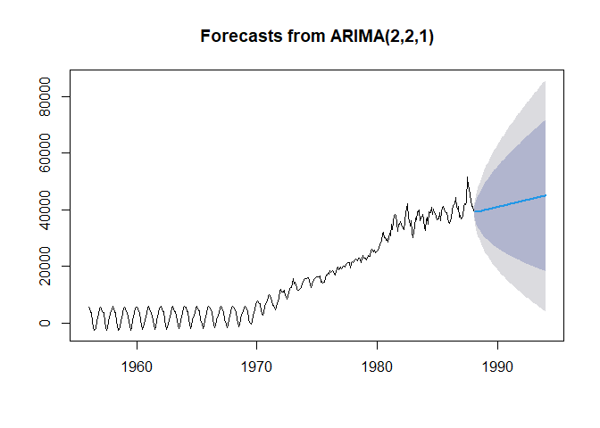<!-- -->

``` r
hist(fcastproduction2$residuals)
```

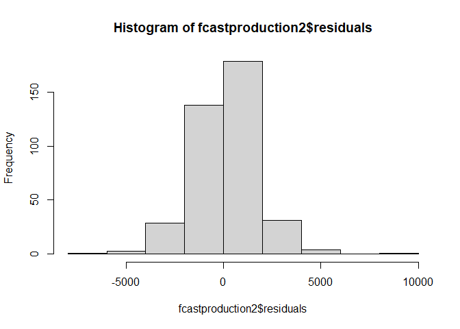<!-- -->

## compute accuracy of the forecast - on the test data

``` r
accuracy(fcastproduction2, production_test)
```

    ##                      ME    RMSE      MAE      MPE     MAPE      MASE       ACF1
    ## Training set   70.45543 1588.01 1161.513 4.211575 42.46949 0.7818774 0.01301379
    ## Test set     4312.23295 6842.67 5282.371 8.141509 10.72073 3.5558491 0.74538918
    ##              Theil's U
    ## Training set        NA
    ## Test set      1.650968

``` r
plot(fcastproduction2$x,col="blue", main= "production A: Actual vs Forecast") 
lines(fcastproduction2$fitted,col="red")
```

<!-- -->

## Let’s try other values and try to reduce error

``` r
productionARIMA3 <- arima(production_train, order = c(2, 2, 2)) 
productionARIMA3
```

    ## 
    ## Call:
    ## arima(x = production_train, order = c(2, 2, 2))
    ## 
    ## Coefficients:
    ##           ar1     ar2      ma1      ma2
    ##       -0.1940  0.2130  -0.6339  -0.3661
    ## s.e.   0.1899  0.0554   0.1899   0.1898
    ## 
    ## sigma^2 estimated as 2517307:  log likelihood = -3368.6,  aic = 6747.2

``` r
tsdisplay(residuals(productionARIMA3), lag.max = 15, main = "Model Residuals")
```

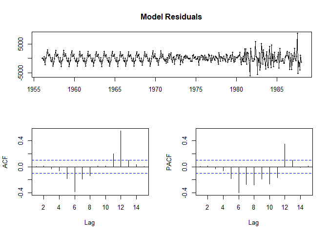<!-- -->

``` r
Box.test(productionARIMA3$residuals)
```

    ## 
    ##  Box-Pierce test
    ## 
    ## data:  productionARIMA3$residuals
    ## X-squared = 0.0054366, df = 1, p-value = 0.9412

**Findings**

  - Residuals are independent. They follow normal distribution. Clearly,
    we can use productionARIMA3(VALID)

## Forecasting with the ARIMA3 model

``` r
fcastproduction3 = forecast(productionARIMA3, h=72)
fcastproduction3
```

    ##          Point Forecast    Lo 80    Hi 80     Lo 95    Hi 95
    ## Feb 1988       39526.44 37490.52 41562.36 36412.770 42640.11
    ## Mar 1988       39278.06 36137.31 42418.82 34474.690 44081.43
    ## Apr 1988       39394.43 35211.04 43577.81 32996.489 45792.37
    ## May 1988       39402.79 34383.15 44422.42 31725.915 47079.66
    ## Jun 1988       39509.79 33733.34 45286.25 30675.465 48344.12
    ## Jul 1988       39574.66 33132.72 46016.60 29722.559 49426.76
    ## Aug 1988       39668.71 32613.14 46724.28 28878.149 50459.27
    ## Sep 1988       39748.12 32128.00 47368.25 28094.145 51402.10
    ## Oct 1988       39836.59 31686.48 47986.70 27372.073 52301.11
    ## Nov 1988       39920.19 31270.93 48569.44 26692.294 53148.08
    ## Dec 1988       40006.66 30882.73 49130.58 26052.820 53960.50
    ## Jan 1989       40091.53 30514.52 49668.54 25444.760 54738.30
    ## Feb 1989       40177.33 30165.49 50189.16 24865.546 55489.11
    ## Mar 1989       40262.60 29832.14 50693.07 24310.583 56214.63
    ## Apr 1989       40348.18 29513.28 51183.08 23777.634 56918.72
    ## May 1989       40433.58 29206.99 51660.18 23263.987 57603.18
    ## Jun 1989       40519.09 28912.20 52125.98 22767.879 58270.29
    ## Jul 1989       40604.53 28627.69 52581.38 22287.530 58921.54
    ## Aug 1989       40690.01 28352.61 53027.41 21821.584 59558.44
    ## Sep 1989       40775.47 28086.12 53464.83 21368.779 60182.17
    ## Oct 1989       40860.94 27827.54 53894.35 20928.069 60793.82
    ## Nov 1989       40946.41 27576.25 54316.57 20498.510 61394.31
    ## Dec 1989       41031.88 27331.71 54732.04 20079.286 61984.47
    ## Jan 1990       41117.34 27093.46 55141.23 19669.663 62565.02
    ## Feb 1990       41202.81 26861.06 55544.56 19268.994 63136.63
    ## Mar 1990       41288.28 26634.13 55942.42 18876.695 63699.86
    ## Apr 1990       41373.75 26412.33 56335.16 18492.241 64255.25
    ## May 1990       41459.21 26195.36 56723.07 18115.159 64803.27
    ## Jun 1990       41544.68 25982.92 57106.44 17745.020 65344.34
    ## Jul 1990       41630.15 25774.76 57485.53 17381.431 65878.86
    ## Aug 1990       41715.61 25570.66 57860.57 17024.035 66407.19
    ## Sep 1990       41801.08 25370.39 58231.77 16672.506 66929.66
    ## Oct 1990       41886.55 25173.76 58599.34 16326.541 67446.55
    ## Nov 1990       41972.02 24980.58 58963.45 15985.865 67958.17
    ## Dec 1990       42057.48 24790.70 59324.26 15650.220 68464.74
    ## Jan 1991       42142.95 24603.95 59681.95 15319.370 68966.53
    ## Feb 1991       42228.42 24420.20 60036.64 14993.095 69463.74
    ## Mar 1991       42313.88 24239.30 60388.47 14671.191 69956.58
    ## Apr 1991       42399.35 24061.13 60737.57 14353.467 70445.23
    ## May 1991       42484.82 23885.58 61084.05 14039.745 70929.89
    ## Jun 1991       42570.29 23712.54 61428.03 13729.860 71410.71
    ## Jul 1991       42655.75 23541.91 61769.59 13423.654 71887.85
    ## Aug 1991       42741.22 23373.59 62108.85 13120.984 72361.46
    ## Sep 1991       42826.69 23207.49 62445.89 12821.711 72831.66
    ## Oct 1991       42912.15 23043.52 62780.78 12525.706 73298.60
    ## Nov 1991       42997.62 22881.62 63113.63 12232.847 73762.39
    ## Dec 1991       43083.09 22721.69 63444.48 11943.021 74223.16
    ## Jan 1992       43168.56 22563.68 63773.43 11656.119 74680.99
    ## Feb 1992       43254.02 22407.51 64100.53 11372.037 75136.01
    ## Mar 1992       43339.49 22253.13 64425.85 11090.680 75588.30
    ## Apr 1992       43424.96 22100.46 64749.45 10811.956 76037.96
    ## May 1992       43510.42 21949.46 65071.39 10535.776 76485.07
    ## Jun 1992       43595.89 21800.07 65391.71 10262.059 76929.72
    ## Jul 1992       43681.36 21652.24 65710.48  9990.725 77371.99
    ## Aug 1992       43766.83 21505.91 66027.74  9721.700 77811.95
    ## Sep 1992       43852.29 21361.05 66343.53  9454.912 78249.67
    ## Oct 1992       43937.76 21217.61 66657.91  9190.293 78685.23
    ## Nov 1992       44023.23 21075.55 66970.91  8927.778 79118.67
    ## Dec 1992       44108.69 20934.82 67282.57  8667.306 79550.08
    ## Jan 1993       44194.16 20795.38 67592.94  8408.817 79979.50
    ## Feb 1993       44279.63 20657.21 67902.05  8152.254 80407.00
    ## Mar 1993       44365.10 20520.26 68209.93  7897.564 80832.63
    ## Apr 1993       44450.56 20384.50 68516.63  7644.693 81256.43
    ## May 1993       44536.03 20249.90 68822.16  7393.593 81678.47
    ## Jun 1993       44621.50 20116.42 69126.57  7144.217 82098.78
    ## Jul 1993       44706.96 19984.04 69429.89  6896.517 82517.41
    ## Aug 1993       44792.43 19852.73 69732.13  6650.450 82934.41
    ## Sep 1993       44877.90 19722.46 70033.34  6405.974 83349.82
    ## Oct 1993       44963.37 19593.20 70333.53  6163.049 83763.68
    ## Nov 1993       45048.83 19464.93 70632.73  5921.634 84176.03
    ## Dec 1993       45134.30 19337.63 70930.97  5681.694 84586.91
    ## Jan 1994       45219.77 19211.26 71228.27  5443.191 84996.34

``` r
plot(fcastproduction3)
```

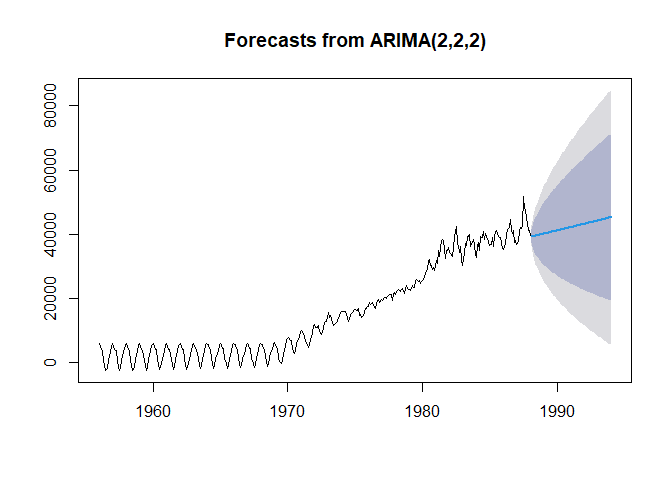<!-- -->

``` r
hist(fcastproduction3$residuals)
```

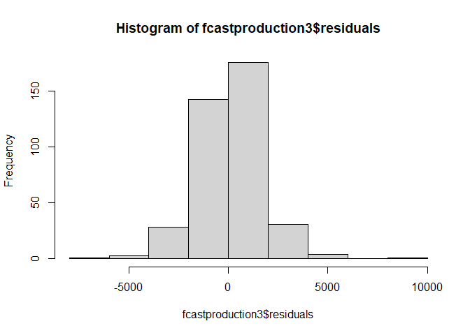<!-- -->

## compute accuracy of the forecast - on the test data

``` r
accuracy(fcastproduction3, production_test)
```

    ##                      ME     RMSE      MAE      MPE     MAPE      MASE
    ## Training set   72.51431 1582.476 1148.262 4.306624 41.85448 0.7729568
    ## Test set     4067.80633 6694.167 5158.713 7.612082 10.48553 3.4726083
    ##                     ACF1 Theil's U
    ## Training set 0.003757808        NA
    ## Test set     0.745701104  1.616634

``` r
plot(fcastproduction3$x,col="blue", main= "production A: Actual vs Forecast") 
lines(fcastproduction3$fitted,col="red")
```

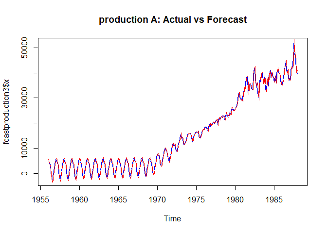<!-- -->

## Let’s try other values and try to reduce error

``` r
productionARIMA4 <- arima(production_train, order = c(1, 2, 3)) 
productionARIMA4
```

    ## 
    ## Call:
    ## arima(x = production_train, order = c(1, 2, 3))
    ## 
    ## Coefficients:
    ##           ar1      ma1      ma2      ma3
    ##       -0.2917  -0.5315  -0.2395  -0.2290
    ## s.e.   0.2514   0.2483   0.2156   0.0602
    ## 
    ## sigma^2 estimated as 2507327:  log likelihood = -3367.91,  aic = 6745.82

``` r
tsdisplay(residuals(productionARIMA4), lag.max = 15, main = "Model Residuals")
```

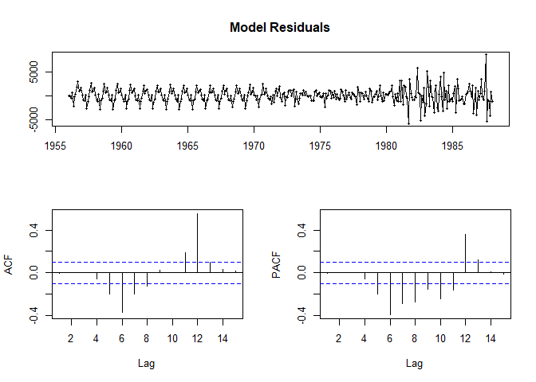<!-- -->

``` r
Box.test(productionARIMA4$residuals)
```

    ## 
    ##  Box-Pierce test
    ## 
    ## data:  productionARIMA4$residuals
    ## X-squared = 0.0035413, df = 1, p-value = 0.9525

**Findings**

  - Residuals are independent. They follow normal distribution. Clearly,
    we can use productionARIMA4(VALID)

## Forecasting with the ARIMA4 model

``` r
fcastproduction4 = forecast(productionARIMA4, h=72)
fcastproduction4
```

    ##          Point Forecast    Lo 80    Hi 80     Lo 95    Hi 95
    ## Feb 1988       39819.63 37787.71 41851.54 36712.082 42927.17
    ## Mar 1988       39591.84 36450.03 42733.65 34786.852 44396.82
    ## Apr 1988       39770.53 35586.63 43954.42 33371.804 46169.25
    ## May 1988       39830.63 34870.11 44791.15 32244.175 47417.09
    ## Jun 1988       39925.33 34276.47 45574.19 31286.140 48564.52
    ## Jul 1988       40009.94 33748.84 46271.03 30434.418 49585.46
    ## Aug 1988       40097.49 33275.17 46919.81 29663.651 50531.33
    ## Sep 1988       40184.18 32841.18 47527.18 28954.034 51414.33
    ## Oct 1988       40271.12 32439.56 48102.69 28293.781 52248.47
    ## Nov 1988       40357.99 32064.40 48651.59 27674.030 53041.96
    ## Dec 1988       40444.89 31711.55 49178.23 27088.393 53801.38
    ## Jan 1989       40531.77 31377.77 49685.77 26531.941 54531.60
    ## Feb 1989       40618.66 31060.57 50176.75 26000.824 55236.49
    ## Mar 1989       40705.55 30757.91 50653.18 25491.952 55919.14
    ## Apr 1989       40792.43 30468.15 51116.71 25002.808 56582.06
    ## May 1989       40879.32 30189.93 51568.71 24531.306 57227.33
    ## Jun 1989       40966.21 29922.09 52010.32 24075.696 57856.71
    ## Jul 1989       41053.09 29663.68 52442.50 23634.494 58471.69
    ## Aug 1989       41139.98 29413.86 52866.10 23206.426 59073.53
    ## Sep 1989       41226.87 29171.90 53281.83 22790.392 59663.34
    ## Oct 1989       41313.75 28937.19 53690.31 22385.433 60242.07
    ## Nov 1989       41400.64 28709.17 54092.11 21990.707 60810.57
    ## Dec 1989       41487.53 28487.35 54487.70 21605.470 61369.58
    ## Jan 1990       41574.41 28271.30 54877.52 21229.061 61919.76
    ## Feb 1990       41661.30 28060.64 55261.95 20860.892 62461.71
    ## Mar 1990       41748.19 27855.03 55641.34 20500.431 62995.94
    ## Apr 1990       41835.07 27654.14 56016.01 20147.203 63522.94
    ## May 1990       41921.96 27457.69 56386.22 19800.775 64043.14
    ## Jun 1990       42008.85 27265.44 56752.25 19460.756 64556.93
    ## Jul 1990       42095.73 27077.15 57114.32 19126.788 65064.68
    ## Aug 1990       42182.62 26892.59 57472.64 18798.544 65566.69
    ## Sep 1990       42269.51 26711.59 57827.42 18475.725 66063.29
    ## Oct 1990       42356.39 26533.95 58178.83 18158.055 66554.73
    ## Nov 1990       42443.28 26359.51 58527.04 17845.281 67041.28
    ## Dec 1990       42530.17 26188.12 58872.21 17537.167 67523.16
    ## Jan 1991       42617.05 26019.64 59214.47 17233.496 68000.61
    ## Feb 1991       42703.94 25853.92 59553.95 16934.065 68473.81
    ## Mar 1991       42790.83 25690.86 59890.79 16638.688 68942.96
    ## Apr 1991       42877.71 25530.33 60225.09 16347.188 69408.24
    ## May 1991       42964.60 25372.24 60556.96 16059.402 69869.79
    ## Jun 1991       43051.49 25216.47 60886.50 15775.177 70327.79
    ## Jul 1991       43138.37 25062.93 61213.81 15494.370 70782.37
    ## Aug 1991       43225.26 24911.54 61538.97 15216.846 71233.67
    ## Sep 1991       43312.14 24762.22 61862.07 14942.478 71681.81
    ## Oct 1991       43399.03 24614.88 62183.19 14671.148 72126.92
    ## Nov 1991       43485.92 24469.45 62502.38 14402.743 72569.09
    ## Dec 1991       43572.80 24325.87 62819.74 14137.157 73008.45
    ## Jan 1992       43659.69 24184.06 63135.32 13874.290 73445.09
    ## Feb 1992       43746.58 24043.98 63449.18 13614.048 73879.11
    ## Mar 1992       43833.46 23905.54 63761.39 13356.340 74310.59
    ## Apr 1992       43920.35 23768.71 64071.99 13101.083 74739.62
    ## May 1992       44007.24 23633.43 64381.04 12848.194 75166.28
    ## Jun 1992       44094.12 23499.65 64688.60 12597.598 75590.65
    ## Jul 1992       44181.01 23367.32 64994.70 12349.221 76012.80
    ## Aug 1992       44267.90 23236.40 65299.40 12102.995 76432.80
    ## Sep 1992       44354.78 23106.84 65602.73 11858.852 76850.72
    ## Oct 1992       44441.67 22978.60 65904.75 11616.731 77266.61
    ## Nov 1992       44528.56 22851.64 66205.48 11376.570 77680.55
    ## Dec 1992       44615.44 22725.92 66504.97 11138.312 78092.58
    ## Jan 1993       44702.33 22601.42 66803.24 10901.903 78502.76
    ## Feb 1993       44789.22 22478.09 67100.35 10667.289 78911.15
    ## Mar 1993       44876.10 22355.90 67396.31 10434.421 79317.79
    ## Apr 1993       44962.99 22234.82 67691.16 10203.251 79722.73
    ## May 1993       45049.88 22114.82 67984.94  9973.731 80126.02
    ## Jun 1993       45136.76 21995.87 68277.66  9745.819 80527.71
    ## Jul 1993       45223.65 21877.94 68569.36  9519.471 80927.83
    ## Aug 1993       45310.54 21761.01 68860.06  9294.646 81326.43
    ## Sep 1993       45397.42 21645.05 69149.80  9071.306 81723.54
    ## Oct 1993       45484.31 21530.04 69438.58  8849.413 82119.21
    ## Nov 1993       45571.20 21415.95 69726.45  8628.930 82513.47
    ## Dec 1993       45658.08 21302.76 70013.41  8409.822 82906.35
    ## Jan 1994       45744.97 21190.44 70299.50  8192.056 83297.89

``` r
plot(fcastproduction4)
```

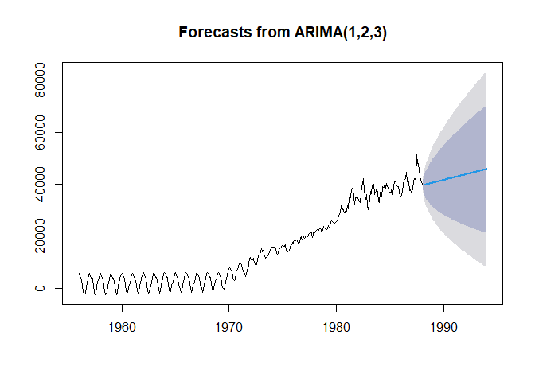<!-- -->

``` r
hist(fcastproduction4$residuals)
```

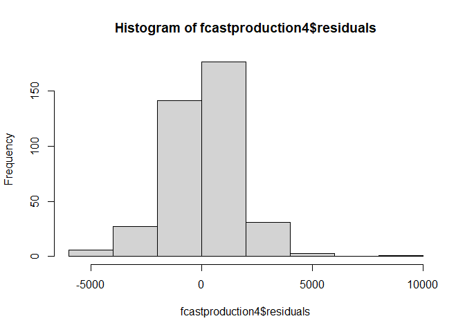<!-- -->

``` r
plot(fcastproduction4$x,col="blue", main= "production A: Actual vs Forecast") 
lines(fcastproduction4$fitted,col="red")
```

<!-- -->

## compute accuracy of the forecast productionARIMA4- on the test data

``` r
accuracy(fcastproduction4, production_test)
```

    ##                      ME     RMSE      MAE      MPE     MAPE      MASE
    ## Training set   77.20057 1579.336 1143.006 4.372532 41.43968 0.7694191
    ## Test set     3585.18499 6419.023 4920.194 6.566698 10.03427 3.3120482
    ##                      ACF1 Theil's U
    ## Training set -0.003032868        NA
    ## Test set      0.746398360  1.554555

## Building Auto ARIMA with season component

``` r
fitautoarima2 <- auto.arima(production_train, seasonal = TRUE)
fitautoarima2
```

    ## Series: production_train 
    ## ARIMA(1,1,1)(0,1,1)[12] 
    ## 
    ## Coefficients:
    ##          ar1      ma1     sma1
    ##       0.4442  -0.8019  -0.4844
    ## s.e.  0.0781   0.0484   0.0503
    ## 
    ## sigma^2 estimated as 1157305:  log likelihood=-3125.02
    ## AIC=6258.04   AICc=6258.15   BIC=6273.72

``` r
tsdisplay(residuals(fitautoarima2), lag.max = 45, main = "Auto ARIMA Model Residuals")
```

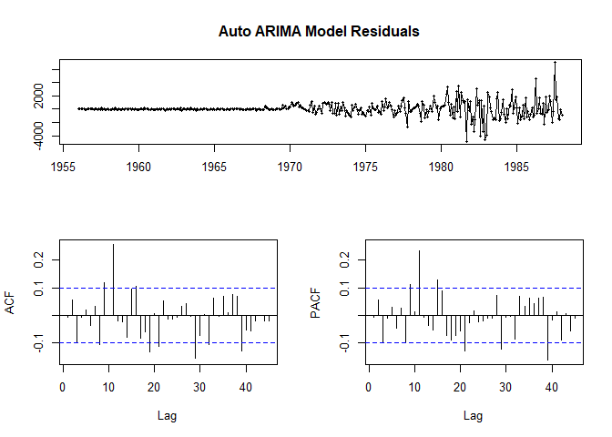<!-- -->

``` r
Box.test(fitautoarima2$residuals)
```

    ## 
    ##  Box-Pierce test
    ## 
    ## data:  fitautoarima2$residuals
    ## X-squared = 0.028648, df = 1, p-value = 0.8656

**Findings**

  - Residuals are independednt. They follow normal distribution.
    Clearly, we can use fitautoarima2(VALID)

## Forecasting with the AUTO ARIMA model2

``` r
fcast_autoArima2 = forecast(fitautoarima2, h=72)
plot(fcast_autoArima2)
```

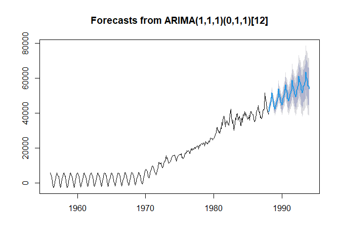<!-- -->

``` r
plot(fcast_autoArima2$x,col="blue", main= "production A: Actual vs Forecast") 
lines(fcast_autoArima2$fitted,col="red")
```

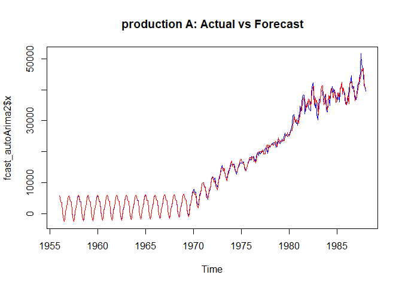<!-- -->

``` r
hist(fcast_autoArima2$residuals)
```

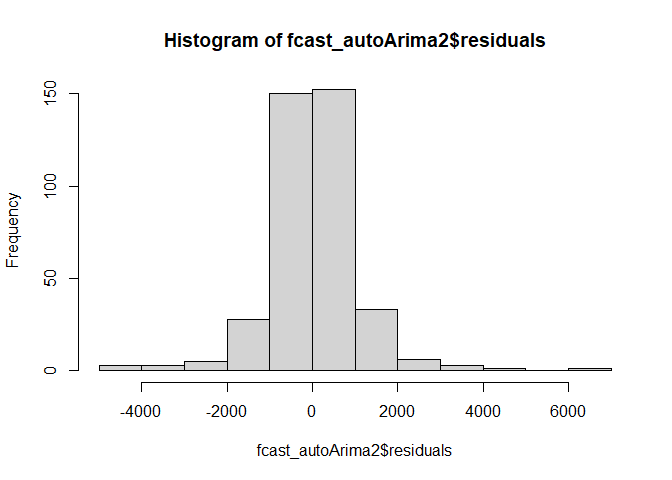<!-- -->

## compute accuracy of the forecast AUTO ARIMA - on the test data

``` r
AccuracyautoARIMA2 <- accuracy(fcast_autoArima2, production_test)
AccuracyautoARIMA2
```

    ##                       ME     RMSE       MAE         MPE      MAPE      MASE
    ## Training set    32.44843 1053.190  597.1876   0.2767693  5.293015 0.4019992
    ## Test set     -5745.28498 7655.097 6439.0360 -13.1634216 14.424347 4.3344626
    ##                      ACF1 Theil's U
    ## Training set -0.008626107        NA
    ## Test set      0.685646026   2.09001

| Models            | RMSE     | MAE       | MPE        | MAPE      | MASE      |
| ----------------- | -------- | --------- | ---------- | --------- | --------- |
| fcastproduction1  | 8843.112 | 7486.108  | 14.550004  | 15.21109  | 5.0393032 |
| fcastproduction2  | 6842.67  | 5282.371  | 8.141509   | 10.72073  | 3.5558491 |
| fcastproduction3  | 6694.167 | 5158.713  | 7.612082   | 10.48553  | 3.4726083 |
| fcastproduction4  | 6419.023 | 4920.194  | 6.566698   | 10.03427  | 3.3120482 |
| fcast\_autoArima  | 5433.903 | 4291.068  | 1.194270   | 9.269967  | 2.888549  |
| fcast\_autoArima2 | 7655.097 | 6439.0360 | 13.1634216 | 14.424347 | 4.3344626 |

**Conculsion**

1)  Looking at the error score above(RMSE, MAE), we can see that Auto
    Arima(fcast\_autoArima ARIMA(1,1,3) with drift) is performing the
    best.

2)  fcastproduction4 is the second best. ARIMA c(1, 2, 3)).

3)  
## Forecast Future values

``` r
futureforecast <- auto.arima(production_train, seasonal = FALSE)
futureforecast
```

    ## Series: production_train 
    ## ARIMA(1,1,3) with drift 
    ## 
    ## Coefficients:
    ##          ar1      ma1      ma2      ma3     drift
    ##       0.6130  -0.5597  -0.0331  -0.2727  104.6819
    ## s.e.  0.0709   0.0790   0.0561   0.0515   27.3930
    ## 
    ## sigma^2 estimated as 2295865:  log likelihood=-3354.8
    ## AIC=6721.61   AICc=6721.83   BIC=6745.31

``` r
tsdisplay(residuals(futureforecast), lag.max = 15, main = "Auto ARIMA Model Residuals")
```

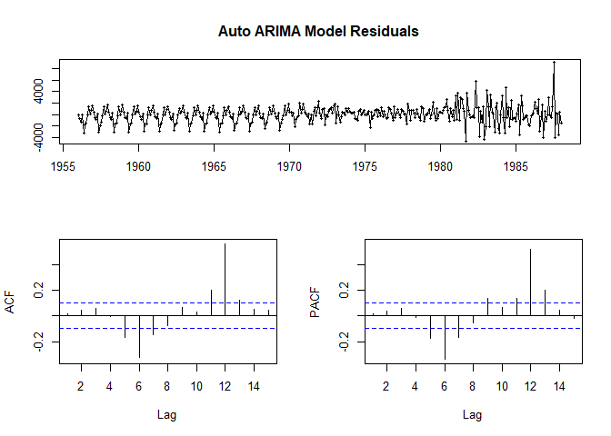<!-- -->

``` r
Box.test(futureforecast$residuals)
```

    ## 
    ##  Box-Pierce test
    ## 
    ## data:  futureforecast$residuals
    ## X-squared = 0.073347, df = 1, p-value = 0.7865

**Findings**

  - Residuals are independent. They follow normal distribution. Clearly,
    we can use futureforecast(VALID)

## Forecasting with the ARIMA4 model

``` r
futureforecastodel = forecast(futureforecast, h=107)
futureforecastodel
```

    ##          Point Forecast    Lo 80    Hi 80    Lo 95    Hi 95
    ## Feb 1988       40429.59 38487.77 42371.41 37459.83 43399.35
    ## Mar 1988       40904.06 38083.70 43724.42 36590.69 45217.43
    ## Apr 1988       41639.54 38155.99 45123.10 36311.90 46967.18
    ## May 1988       42130.92 38332.33 45929.50 36321.48 47940.35
    ## Jun 1988       42472.64 38492.12 46453.17 36384.95 48560.33
    ## Jul 1988       42722.64 38620.73 46824.55 36449.31 48995.97
    ## Aug 1988       42916.40 38723.57 47109.22 36504.02 49328.77
    ## Sep 1988       43075.68 38808.43 47342.94 36549.48 49601.89
    ## Oct 1988       43213.84 38881.58 47546.10 36588.22 49839.46
    ## Nov 1988       43339.04 38947.44 47730.65 36622.66 50055.42
    ## Dec 1988       43456.30 39008.90 47903.71 36654.59 50258.02
    ## Jan 1989       43568.70 39067.82 48069.57 36685.20 50452.19
    ## Feb 1989       43678.10 39125.37 48230.84 36715.29 50640.91
    ## Mar 1989       43785.68 39182.26 48389.11 36745.35 50826.02
    ## Apr 1989       43892.14 39238.93 48545.35 36775.68 51008.61
    ## May 1989       43997.91 39295.67 48700.16 36806.45 51189.38
    ## Jun 1989       44103.26 39352.61 48853.91 36837.77 51368.75
    ## Jul 1989       44208.35 39409.87 49006.84 36869.70 51547.00
    ## Aug 1989       44313.29 39467.49 49159.09 36902.27 51724.30
    ## Sep 1989       44418.12 39525.49 49310.75 36935.49 51900.75
    ## Oct 1989       44522.90 39583.90 49461.89 36969.36 52076.44
    ## Nov 1989       44627.64 39642.72 49612.56 37003.86 52251.42
    ## Dec 1989       44732.35 39701.93 49762.77 37038.99 52425.72
    ## Jan 1990       44837.06 39761.55 49912.57 37074.74 52599.38
    ## Feb 1990       44941.75 39821.56 50061.95 37111.09 52772.42
    ## Mar 1990       45046.44 39881.95 50210.94 37148.03 52944.86
    ## Apr 1990       45151.13 39942.71 50359.55 37185.54 53116.72
    ## May 1990       45255.82 40003.84 50507.79 37223.62 53288.01
    ## Jun 1990       45360.50 40065.33 50655.67 37262.24 53458.76
    ## Jul 1990       45465.18 40127.17 50803.20 37301.40 53628.97
    ## Aug 1990       45569.86 40189.35 50950.38 37341.07 53798.66
    ## Sep 1990       45674.55 40251.86 51097.24 37381.26 53967.83
    ## Oct 1990       45779.23 40314.69 51243.76 37421.94 54136.52
    ## Nov 1990       45883.91 40377.85 51389.97 37463.11 54304.71
    ## Dec 1990       45988.59 40441.31 51535.87 37504.76 54472.43
    ## Jan 1991       46093.28 40505.08 51681.47 37546.87 54639.68
    ## Feb 1991       46197.96 40569.15 51826.77 37589.44 54806.48
    ## Mar 1991       46302.64 40633.51 51971.77 37632.45 54972.83
    ## Apr 1991       46407.32 40698.15 52116.49 37675.89 55138.75
    ## May 1991       46512.00 40763.07 52260.94 37719.77 55304.24
    ## Jun 1991       46616.68 40828.26 52405.11 37764.06 55469.31
    ## Jul 1991       46721.37 40893.72 52549.01 37808.76 55633.98
    ## Aug 1991       46826.05 40959.45 52692.65 37853.86 55798.24
    ## Sep 1991       46930.73 41025.43 52836.03 37899.35 55962.11
    ## Oct 1991       47035.41 41091.66 52979.16 37945.23 56125.60
    ## Nov 1991       47140.09 41158.14 53122.05 37991.49 56288.70
    ## Dec 1991       47244.78 41224.86 53264.69 38038.11 56451.44
    ## Jan 1992       47349.46 41291.82 53407.09 38085.10 56613.81
    ## Feb 1992       47454.14 41359.02 53549.26 38132.45 56775.83
    ## Mar 1992       47558.82 41426.44 53691.20 38180.15 56937.49
    ## Apr 1992       47663.50 41494.09 53832.92 38228.20 57098.81
    ## May 1992       47768.19 41561.96 53974.42 38276.58 57259.79
    ## Jun 1992       47872.87 41630.04 54115.69 38325.29 57420.45
    ## Jul 1992       47977.55 41698.34 54256.76 38374.33 57580.77
    ## Aug 1992       48082.23 41766.85 54397.61 38423.69 57740.77
    ## Sep 1992       48186.91 41835.56 54538.26 38473.36 57900.46
    ## Oct 1992       48291.59 41904.48 54678.71 38523.35 58059.84
    ## Nov 1992       48396.28 41973.60 54818.96 38573.64 58218.92
    ## Dec 1992       48500.96 42042.91 54959.01 38624.23 58377.69
    ## Jan 1993       48605.64 42112.42 55098.87 38675.11 58536.17
    ## Feb 1993       48710.32 42182.11 55238.54 38726.28 58694.36
    ## Mar 1993       48815.00 42251.99 55378.02 38777.74 58852.27
    ## Apr 1993       48919.69 42322.06 55517.32 38829.48 59009.89
    ## May 1993       49024.37 42392.30 55656.44 38881.50 59167.24
    ## Jun 1993       49129.05 42462.72 55795.38 38933.78 59324.32
    ## Jul 1993       49233.73 42533.32 55934.14 38986.34 59481.12
    ## Aug 1993       49338.41 42604.09 56072.73 39039.16 59637.67
    ## Sep 1993       49443.10 42675.03 56211.16 39092.24 59793.95
    ## Oct 1993       49547.78 42746.14 56349.41 39145.57 59949.98
    ## Nov 1993       49652.46 42817.41 56487.50 39199.16 60105.76
    ## Dec 1993       49757.14 42888.85 56625.43 39253.00 60261.29
    ## Jan 1994       49861.82 42960.45 56763.20 39307.08 60416.57
    ## Feb 1994       49966.51 43032.20 56900.81 39361.40 60571.61
    ## Mar 1994       50071.19 43104.11 57038.27 39415.96 60726.41
    ## Apr 1994       50175.87 43176.17 57175.57 39470.75 60880.98
    ## May 1994       50280.55 43248.38 57312.72 39525.78 61035.32
    ## Jun 1994       50385.23 43320.75 57449.72 39581.04 61189.43
    ## Jul 1994       50489.91 43393.26 57586.57 39636.52 61343.31
    ## Aug 1994       50594.60 43465.91 57723.28 39692.22 61496.98
    ## Sep 1994       50699.28 43538.71 57859.84 39748.14 61650.42
    ## Oct 1994       50803.96 43611.65 57996.27 39804.28 61803.65
    ## Nov 1994       50908.64 43684.73 58132.55 39860.63 61956.66
    ## Dec 1994       51013.32 43757.95 58268.70 39917.19 62109.46
    ## Jan 1995       51118.01 43831.30 58404.71 39973.95 62262.06
    ## Feb 1995       51222.69 43904.79 58540.59 40030.93 62414.45
    ## Mar 1995       51327.37 43978.41 58676.33 40088.10 62566.63
    ## Apr 1995       51432.05 44052.16 58811.94 40145.48 62718.62
    ## May 1995       51536.73 44126.04 58947.43 40203.05 62870.41
    ## Jun 1995       51641.42 44200.05 59082.78 40260.82 63022.01
    ## Jul 1995       51746.10 44274.18 59218.02 40318.78 63173.41
    ## Aug 1995       51850.78 44348.44 59353.12 40376.94 63324.62
    ## Sep 1995       51955.46 44422.82 59488.11 40435.28 63475.65
    ## Oct 1995       52060.14 44497.32 59622.97 40493.80 63626.49
    ## Nov 1995       52164.82 44571.94 59757.71 40552.51 63777.14
    ## Dec 1995       52269.51 44646.68 59892.33 40611.40 63927.61
    ## Jan 1996       52374.19 44721.54 60026.84 40670.47 64077.91
    ## Feb 1996       52478.87 44796.51 60161.23 40729.71 64228.03
    ## Mar 1996       52583.55 44871.60 60295.51 40789.13 64377.97
    ## Apr 1996       52688.23 44946.80 60429.67 40848.73 64527.74
    ## May 1996       52792.92 45022.11 60563.72 40908.49 64677.34
    ## Jun 1996       52897.60 45097.53 60697.66 40968.43 64826.77
    ## Jul 1996       53002.28 45173.07 60831.49 41028.53 64976.03
    ## Aug 1996       53106.96 45248.71 60965.22 41088.80 65125.13
    ## Sep 1996       53211.64 45324.45 61098.83 41149.23 65274.06
    ## Oct 1996       53316.33 45400.31 61232.34 41209.82 65422.83
    ## Nov 1996       53421.01 45476.26 61365.75 41270.57 65571.44
    ## Dec 1996       53525.69 45552.33 61499.05 41331.48 65719.90

``` r
plot(futureforecastodel)
```

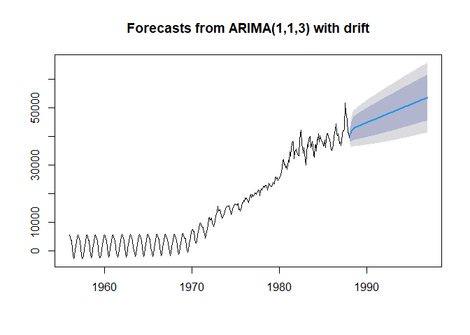<!-- -->

``` r
hist(futureforecastodel$residuals)
```

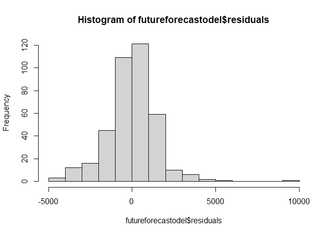<!-- -->

## With 95 percent confidence. The future forecasted production till December 1996 (One Year or 12 months beyond available data.

``` r
tail(futureforecastodel$mean,n=12)
```

    ##           Jan      Feb      Mar      Apr      May      Jun      Jul      Aug
    ## 1996 52374.19 52478.87 52583.55 52688.23 52792.92 52897.60 53002.28 53106.96
    ##           Sep      Oct      Nov      Dec
    ## 1996 53211.64 53316.33 53421.01 53525.69

**Findings**

  - 1 Year forecast of Australian Gas Production will help Australian
    Gas company to estimate the customers needs and preferences along
    with competitors’ strategy in the future. So, production forecasting
    is an estimation of a wide range of future events, which affect the
    production of the organization. Elements of planning and production
    cycles, companies can operate with more agility, transparency, and
    flexibility to adapt to changing production environments or schemes.
